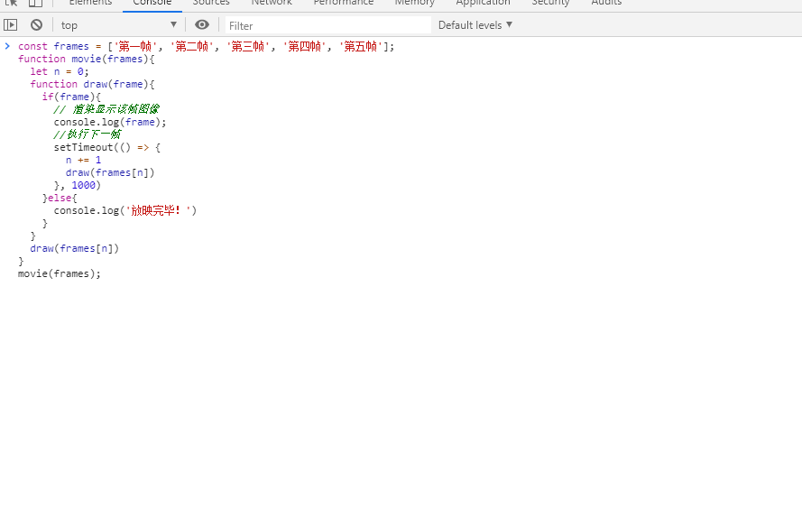
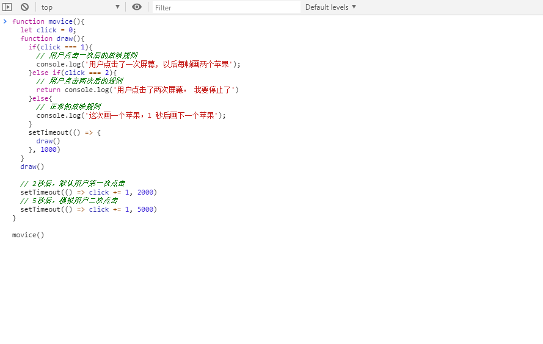
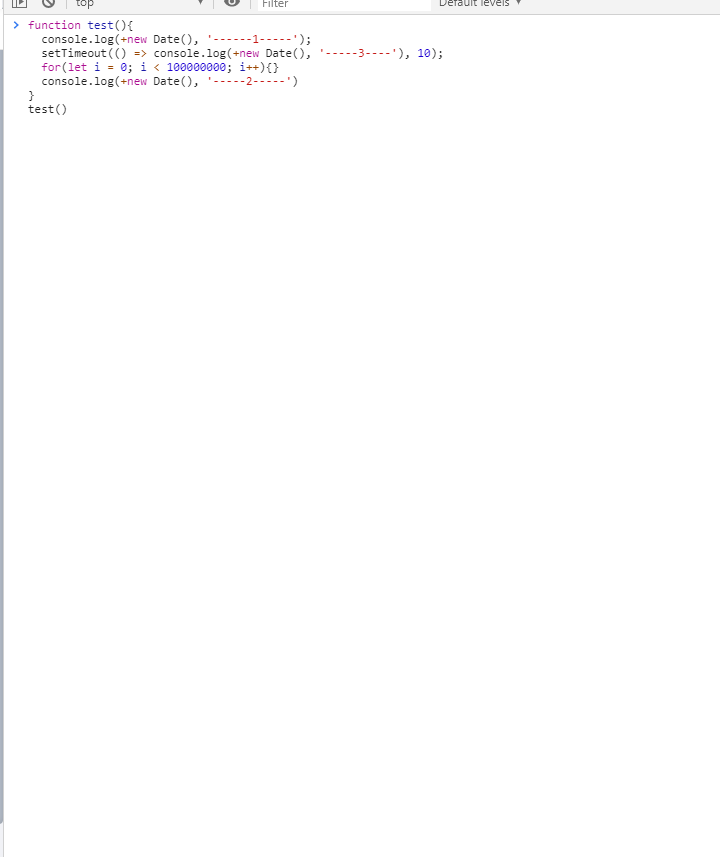
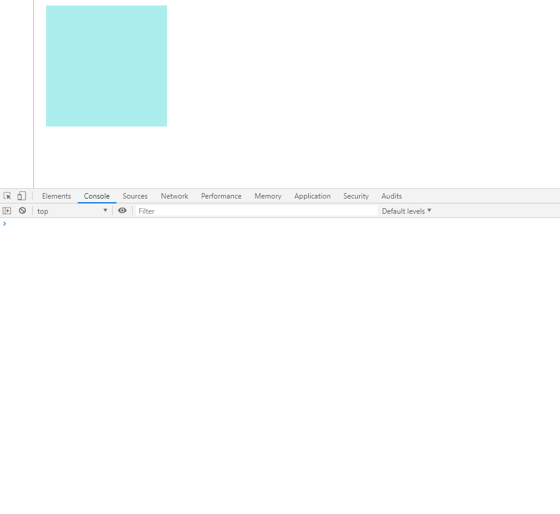
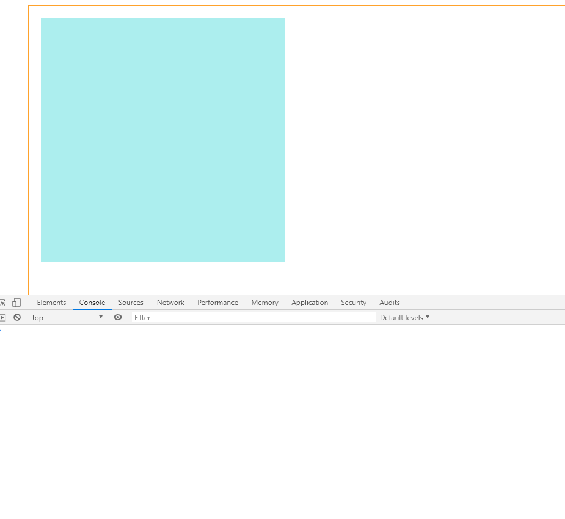
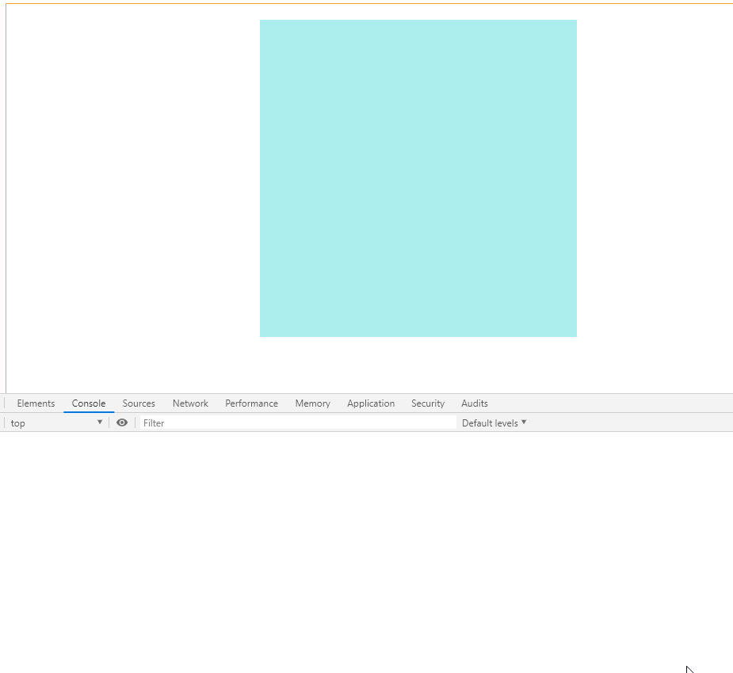

## 前言
动画是一个创造运动假象的过程。几乎所有的投影运动媒体都采用帧实现运动。—— 《HTML5+JavaScript动画基础》

## 相关知识
### 静态动画  

我们知道，投影动画由一帧帧的图像切换而得到，而每一帧的内容是事先已经存在的，不可变的。    
这种动画不会与用户产生交互效果（你关闭电源，动画暂停不能算作交互），不管用户做了何种操作，如点击鼠标、敲击键盘，缩放浏览器等等，动画只会以我们事先排好的帧顺序切换。        

我们用下面代码，做一个简单模拟：
```js
const frames = ['第一帧', '第二帧', '第三帧', '第四帧', '第五帧'];
function movie(frames){
  let n = 0;
  function draw(frame){
    if(frame){
      // 渲染显示该帧图像
      console.log(frame);
      //执行下一帧
      setTimeout(() => {
        n += 1
        draw(frames[n])
      }, 1000)
    }else{
      console.log('放映完毕！')
    }
  }
  draw(frames[n])
}
movie(frames);
```

效果图如下： 



### 动态动画   

动态动画与静态动画的区别在于，在绘制当前帧的时候，并不会知道下一帧要绘制什么内容。

动态动画会在自己的绘制方法中维护一套规则，通过每次绘制前对当前环境的规则校验，来确定即将要绘制的图形内容。

以此，来完成和用户交互的目的。      

模拟代码如下：    

```js
function movice(){
  let click = 0;
  function draw(){
    if(click === 1){
      // 用户点击一次后的放映规则
      console.log('用户点击了一次屏幕, 以后每帧画两个苹果');
    }else if(click === 2){
      // 用户点击两次后的规则
      return console.log('用户点击了两次屏幕， 我要停止了')
    }else{
      // 正常的放映规则
      console.log('这次画一个苹果，1 秒后画下一个苹果');
    }
    setTimeout(() => {
      draw()
    }, 1000)
  }
  draw()

  // 2秒后，默认用户第一次点击
  setTimeout(() => click += 1, 2000)
  // 5秒后，模拟用户二次点击
  setTimeout(() => click += 1, 5000)
}

movice()
```

效果图如下： 



## eventloop
我们知道 `js` 是单线程，代码自上至下执行时，遇到宏任务则会添加进宏任务队列，遇到微任务则会添加进微任务队列。

当代码执行完毕后，会首先检查自上而下执行代码产生的微任务，清空微任务队列后，会从宏任务队列中取出要执行的宏任务，执行完这个宏任务后，会再次检查有没有产生微任务，如果产生了微任务，则会清空。之后，会再次检查宏任务队列，周而复始，形成事件环。

定时器属于宏任务，`Promise` 中的 `then`，`process.nextTick` 属于微任务。


## requestAnimationFrname [MDN文档](https://developer.mozilla.org/zh-CN/docs/Web/API/Window/requestAnimationFrame)

在早期的 `html` 规范中，并没有考虑到动画的场景，因此也没有相对应的 API 来供我们使用。

我们只能通过 `setTimeout` 来实现动画效果。但是通过了解 `eventloop` 我们可以知道 `setTimeout` 的计时是不准确的。

代码自上而下执行，遇到 `setTimeout` 则会挂起，等待当前代码执行完毕之后才会执行 `setTimeout`，若当前代码量较大时，会造成计时不精确。如下：     

```js
/**
 *  到达 setTimeout 时间后，当前代码仍在执行时 
 **/
function test(){
  console.log(+new Date(), '------1-----');
  setTimeout(() => console.log(+new Date(), '-----3----'), 10);
  for(let i = 0; i < 100000000; i++){}
  console.log(+new Date(), '-----2-----')
}
test()
// 1578480299388 "------1-----"
// 1578480299442 "-----2-----"
// 1578480299442 "-----3----"


/**
 *  到达 setTimeout 时间后，当前代码已经执行完时
 **/

function test(){
  console.log(+new Date(), '------1-----');
  setTimeout(() => console.log(+new Date(), '-----3----'), 70);
  for(let i = 0; i < 100000000; i++){}
  console.log(+new Date(), '-----2-----')
}
test()

// 1578480314090 "------1-----"
// 1578480314143 "-----2-----"
// 1578480314161 "-----3----"

```   

效果图如下：



通过代码打印，我们可以清楚的看到 `setTimeout` 的不精确性。

`requestAnimationFrname` 会在浏览器下次重绘之前调用指定的回调函数更新动画，回调函数执行次数通常与浏览器屏幕刷新次数相匹配。不仅避免了 `setTimeout` 的时间不精确问题，而且有效的提高了性能。


## 封装自己的 animation
通过上面知识的铺垫，下面我们来封装自己的动画函数。

我们先新建一个 `html` 页面，代码如下：    
```html
  <!-- 简单的样式 -->
  <style>
    .box {
      margin: 50px;
      width: 1000px;
      height: 700px;
      border: 1px solid orange;
      padding: 20px;
    }

    .target {
      width: 200px;
      height: 200px;
      background: paleturquoise;
    }
  </style>

  <!-- DOM 结构 -->
  <div class="box">
    <div class="target" id="target"></div>
  </div>

  <!-- js 脚本 -->
  <script>
    function animated(target, props, duration) {
      // 执行动画
    }
    let target = document.getElementById('target');
    // 最终样式
    let props = {
      width: '400px',
      height: '400px'
    }
    animated(target, props, 2000)
  </script>
```
我们知道：动画分为动态动画和静态动画两种。而不管是我们使用 `requestAnimationFrname` 还是 `setTimeout` ，都不能做到时间上的精确，所以我们并不能确定要在何时显示下一帧图像。因此，我们无法通过事先的计算，得到所有帧的描述信息。所以在我们的 `animated`  方法中，我们一定是使用动态动画的方式来实现动画。

确定了实现动画的方式，我们便知道了接下来需要做些什么：我们需要维护一套规则，在每次 `animated` 函数调用时，来匹配规则内容，然后得到需要显示的图像信息，最后显示出来。

我们再来细化一下思路：
- 获取目标的当前信息，计算出当前信息与最终期望信息的差值
- 每次 `animated` 函数触发时，计算出动画运行时间与设定时间的比值
- 通过时间比值，得到需要渲染的图像信息
- 设置临界判断，设定时间超超出时，终止动画

根据以上思路，我们来改造 `animate` 函数：

```js
function animated(target, props, duration) {
  // 记录动画开始时间
  let start = +new Date();
  // 记录最初信息
  let cssInfo = getInfo(target)
  // 执行动画
  function draw(){
    // 校验是否超出临界值
    let percent = getProgress();
    console.log(percent, '===')
    // 超出临界值则终止动画
    if(percent >= 1) return;
    // 未超出临界值则继续更新目标元素信息
    setStyle(percent);
    // 进入下一次循环
    window.requestAnimationFrame(draw)
  }
  window.requestAnimationFrame(draw)

  // 工具方法
  function setStyle(percent){
    console.log('-=-=-=setStyle', percent)
  }
  function getInfo(el){
    let css = el.ownerDocument.defaultView.getComputedStyle(el, null);
    let cssInfo = {};
    for(let key in props){
      cssInfo[key] = css.getPropertyValue(key)
    }
    return cssInfo
  }
  function getProgress(){
    let percent = (+new Date() - start) / duration;
    return percent >= 1 ? 1 : percent;
  }
}

```
效果图如下：


通过观察效果图，我们发现，当最后一次校验进度时，若超出临界值则直接停止，可是在上一次更新信息时，进度还不到百分百，如果直接停止，则会造成细微的误差。

为了避免这种误差，我们需要维护另一个变量，来保存上次的进度，如果上次进度不到百分百，而当前进度达到百分百时，我们需要添加一次绘制。

如下：  

```js
// 新增代码
function animated(target, props, duration) {
  // ... ...略
  // 记录上次进度
  let oldPercent = 0;
      
  // 执行动画
  function draw(){
   // ... ...略

    // 超出临界值则终止动画
    if(percent >= 1 && oldPercent >= 1) return;
    // 未超出临界值则继续更新目标元素信息
    setStyle(percent);
    // 保存进度
    oldPercent = percent;
    // 进入下一次循环
    window.requestAnimationFrame(draw)
  }
  // ... ...略
}

```

效果图如下：


现在，我们已经完成了基本的逻辑流程，只要用 `setStyle` 方法更新信息即可完成动画。  

下面，我们来完成 `setStyle` 方法：

```js
function setStyle(percent){
  let style = getStyle(cssInfo, props, percent);
  for(let key in style){
    target.style[key] = style[key]
  }
}

function getStyle(cssInfo, props, percent){
  let style = {};
  for(let key in props){
    let cssVal = parseFloat(cssInfo[key]);
    let propsVal = parseFloat(props[key]);
    let newVal = (propsVal - cssVal) * percent + cssVal;
    style[key] = `${newVal}px`
  }
  return style;
}
```

效果图如下：


## 最终效果
以上，我们已经完成了一个基本的动画函数，我们还可以通过设置 `left`,`top`,`right`,`bottom`, `margin` 等属性，来实现位置的移动。

例如： 
```js
  // ... ...略
  let props = {
    width: '400px',
    height: '400px',
    'margin-left': '300px'
  }
  // ... ...略
```

效果图如下：



当然，这个函数还有很多需要优化的地方，例如我们最后传入的 `margin-left`，并不能用 `marginLeft` 这种驼峰的形式传入。我们还需要在 `getStyle` 中做大量的判断，来实现对 `background`, `transform`, `opacity` 等等属性的兼容。还可以在动画中加入三角函数运算，使得动画的渐变更加平滑。等等... ...

## 结语
以上，我们已经对 `js` 的动画原理做了简单了解。    
若有错误，请务必给予指正。      
谢谢！   

## 参考书籍
《HTML5+JavaScript动画基础》
 
