## 如题，脚本如下：
```deploy.sh
#!/bin/bash

# 脚本只要发生错误，就终止执行。
set -e

# 生成静态文件
npm run build

# 判读是否存在 .git目录
if [ -d .git/ ];then
echo '已经是一个git仓库，需要删除已有pages分支后重新拉取新分支'
# 删除已有分支，避免代码合并冲突
git branch -D pages
# 添加工作区所有变化到暂存区
git add -A
# 将暂存区里的改动提交到本地的版本库
git commit -m 'add'

# 如果不存在 .git 证明不是git仓库，需要初始化git仓库
else
echo '初始化git仓库'
# 初始化git仓库
git init
# 添加工作区所有变化到暂存区
git add -A
# 将暂存区里的改动提交到本地的版本库
git commit -m 'add'
# 命名当前分支
git branch -M master
# 关联远端仓库
git remote add origin [git@github.com:xxx] #自己的代码仓库
fi

## 将更新推送到远程主分支
git push --set-upstream -f origin master

# 进入pages分支
git checkout -b pages

# 将dist移动到根目录
cp -rf docs/.vuepress/dist ./dist
# 删除原有的docs文件夹
rm -rf docs/
# 将dist重命名
mv ./dist/ ./docs/

# 提交更新
git add -A
git commit -m 'deploy'
git push --set-upstream -f origin pages

# 回到主分支
git checkout master

```
## 新建VuePress文档
参考[VuePress](https://vuepress.vuejs.org/zh/guide/getting-started.html)<code>快速上手</code>

1、创建并进入一个新目录
```
mkdir vuepress-starter && cd vuepress-starter
```
2、使用你喜欢的包管理器进行初始化
```
yarn init # npm init
```
3、将 VuePress 安装为本地依赖
```
yarn add -D vuepress # npm install -D vuepress
```
4、创建你的第一篇文档
```
mkdir docs && echo '# Hello VuePress' > docs/README.md
```
5、在 `package.json` 中添加一些 [scripts](https://classic.yarnpkg.com/zh-Hans/docs/package-json#toc-scripts)
```
{
  "scripts": {
    "dev": "vuepress dev docs",
    "build": "vuepress build docs"
  }
}
```
6、在本地启动服务器
```
yarn dev # npm run dev
```

以上命令可以新建一个基础VuePress文档，并在会在 [http://localhost:8080 (opens new window)](http://localhost:8080/)启动一个热重载的开发服务器。

## 新建github仓库

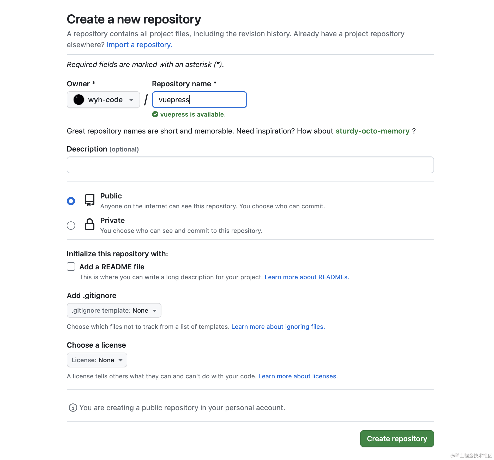

## 添加项目配置
1、配置部署站点的基础路径 <code>此处应为github 仓库名</code>[更多配置](https://vuepress.vuejs.org/zh/config/#%E5%9F%BA%E6%9C%AC%E9%85%8D%E7%BD%AE)

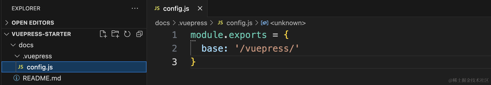

## 添加脚本
1、在VuePress文档中新建`deploy.sh`（复制最上边脚本）

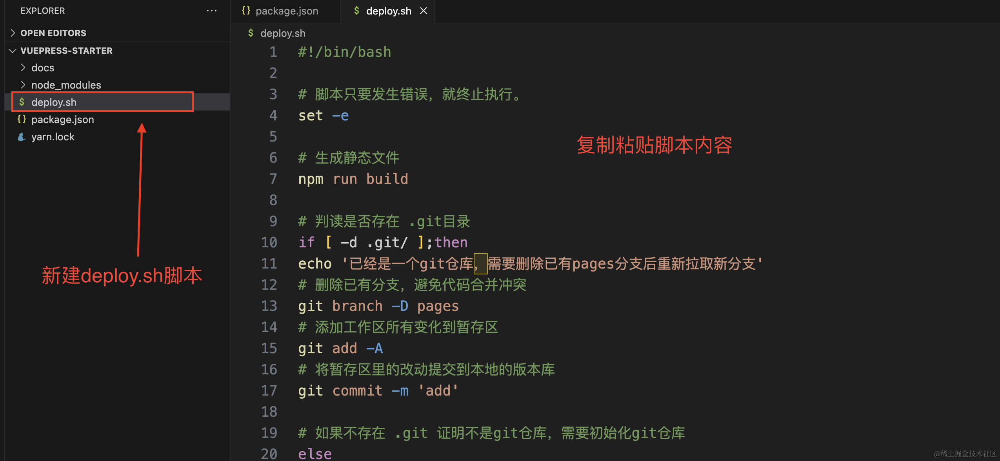

2、复制github仓库地址

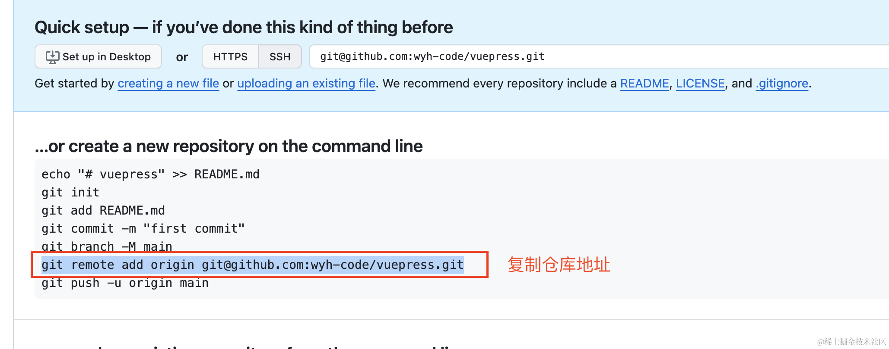

3、修改脚本远端仓库地址

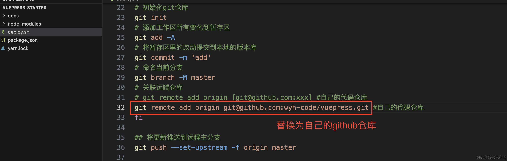

4、添加忽略文件`.gitignore`

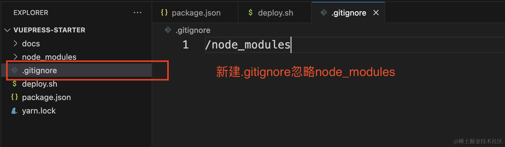

## 部署文档
在根目录执行 `sh deploy.sh` 命令


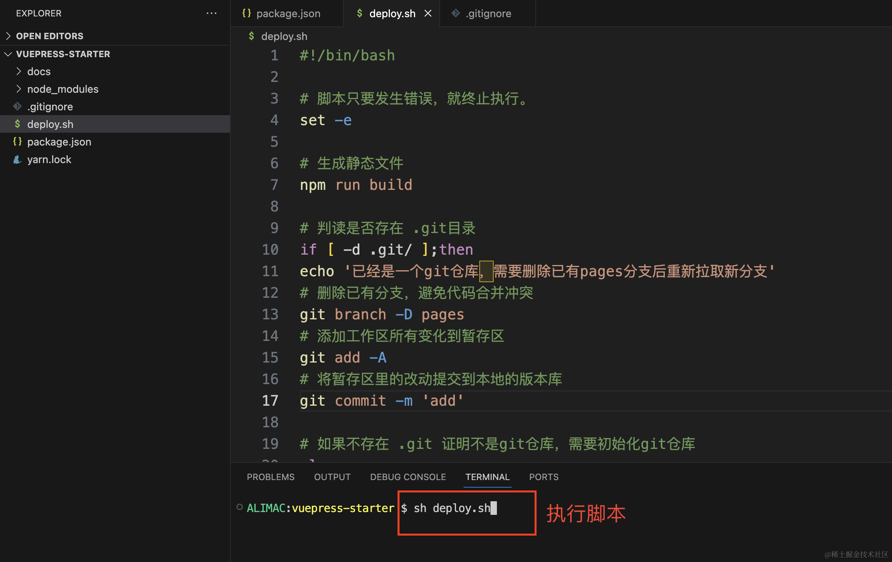

## 配置github
1、进入Setting页

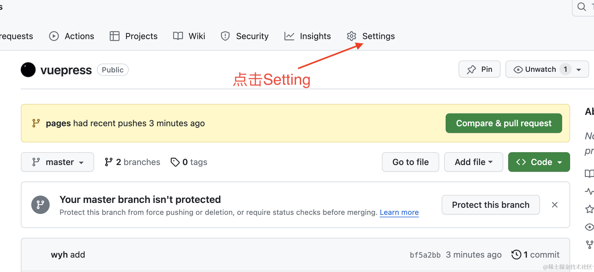

2、选择分支及文档目录

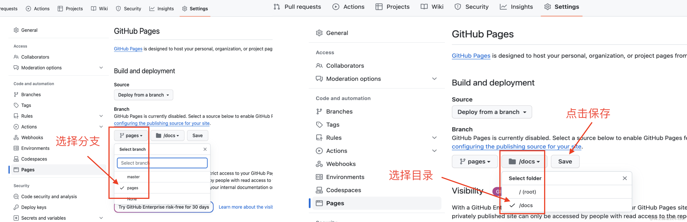

3、刷新页面号，获取站点URL

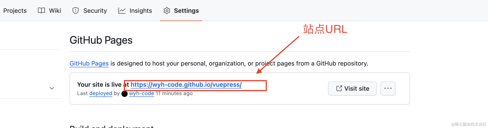

4、复制URL，在浏览器窗口打开，即可看到部署好的博客站点

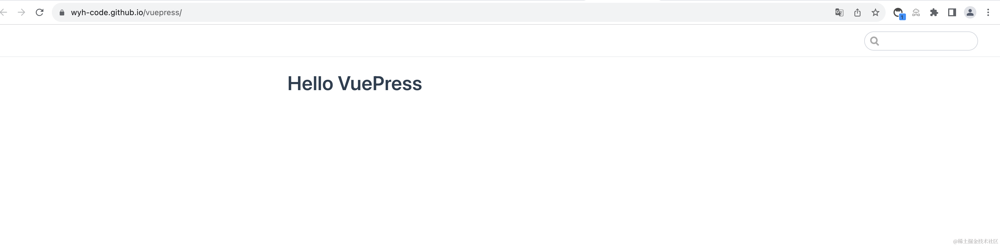

### <code>注意:</code>
**生成站点地址会有几分钟的延迟，若刷新页面没有出现站点地址，请耐心等待几分钟**

**文档只可放在根目录（/）或（/docs）目录下：**


## 结语  
若有错误，请务必给予指正。      
谢谢！

## 参考文档
[Bash 脚本 set 命令教程](https://www.ruanyifeng.com/blog/2017/11/bash-set.html)

[Shell 教程](https://www.runoob.com/linux/linux-shell-passing-arguments.html)
