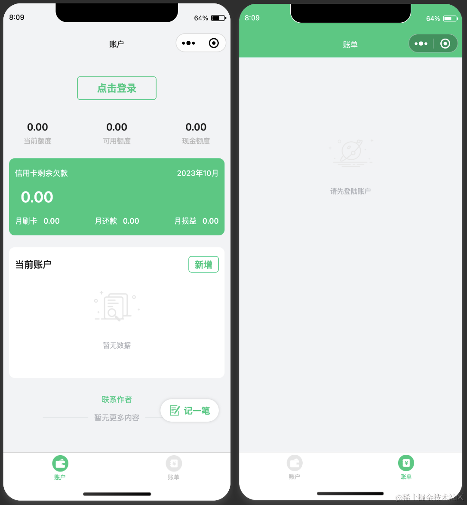
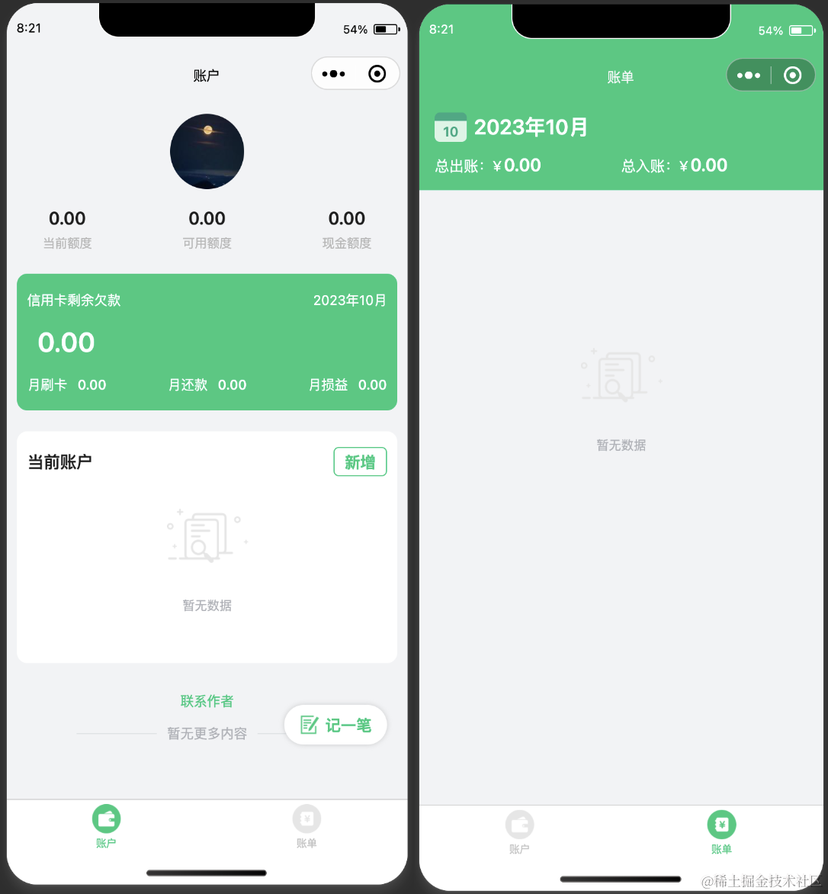
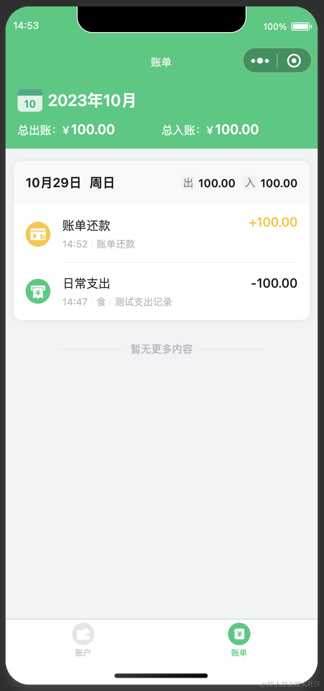
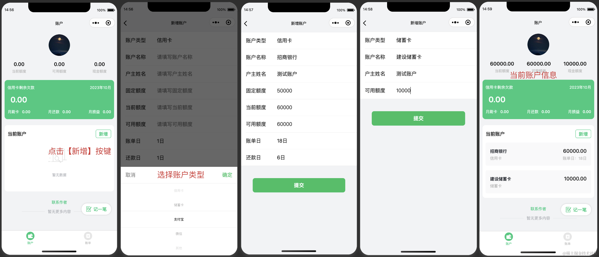
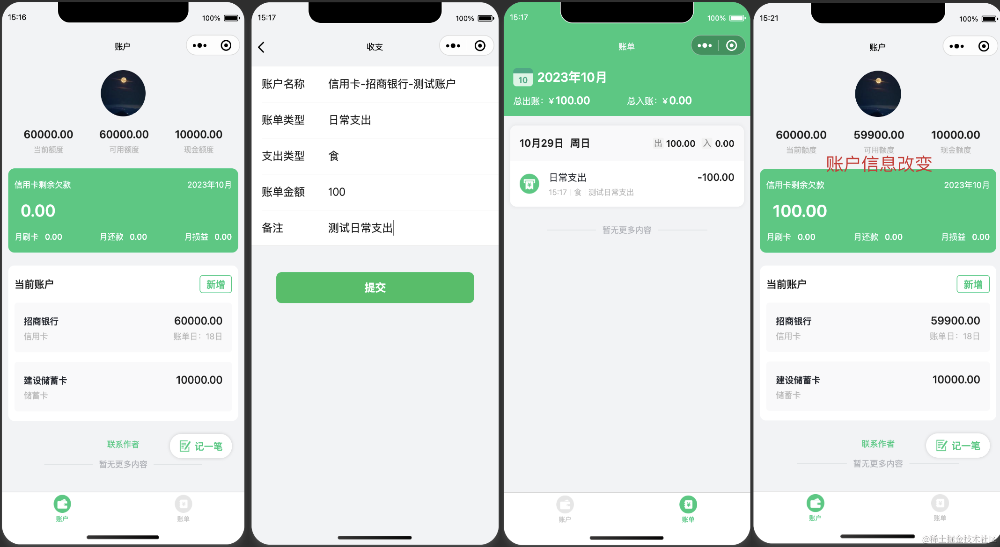
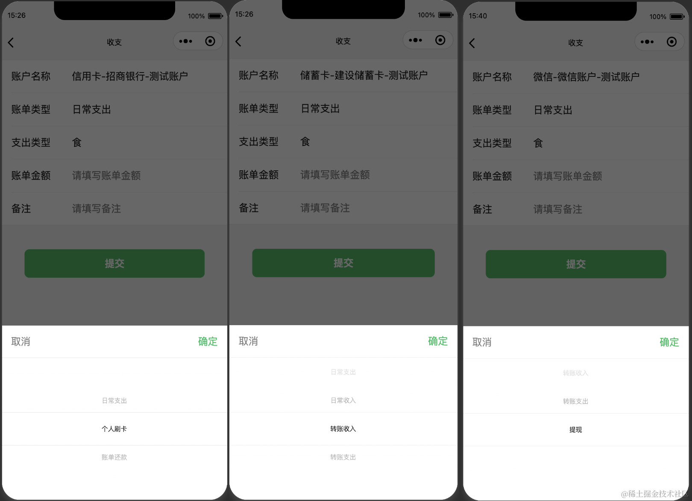
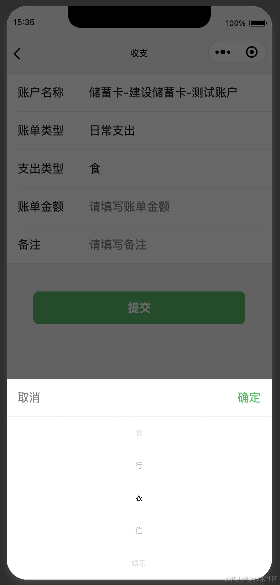
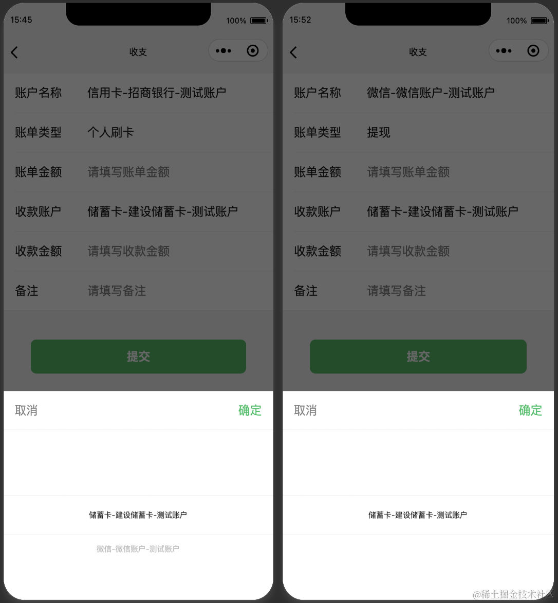
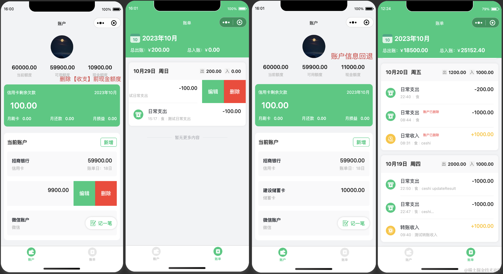
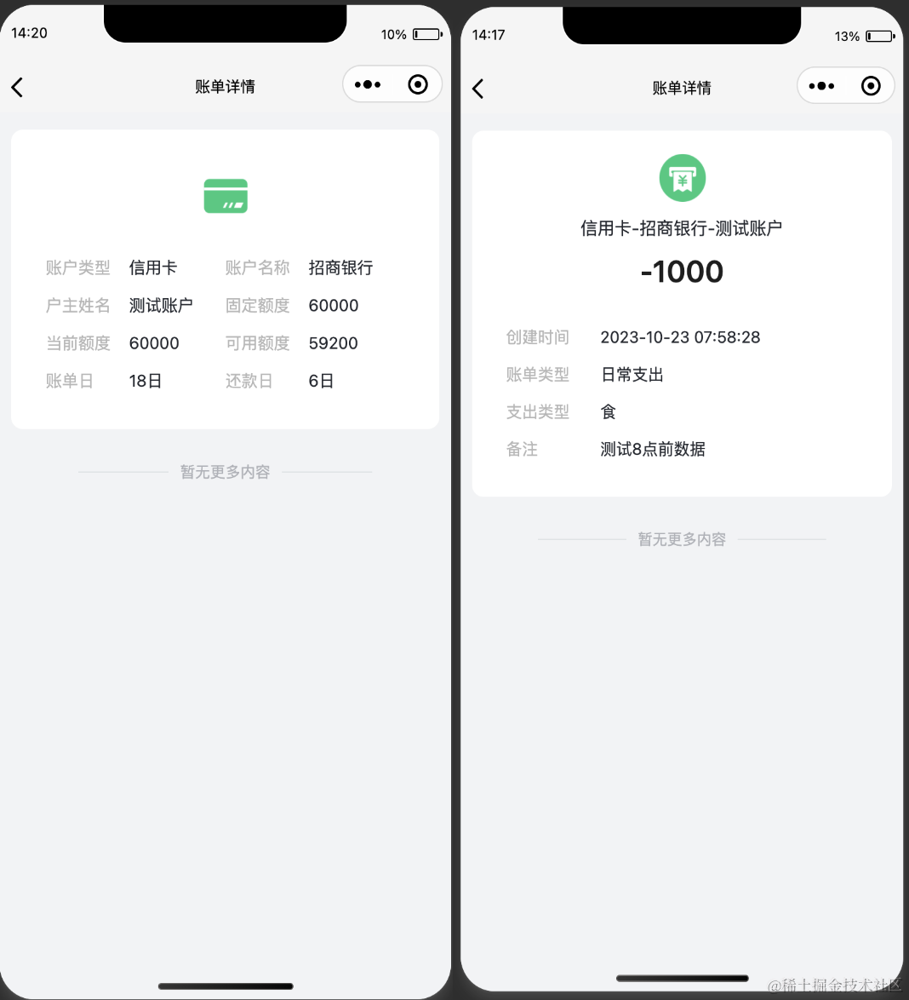

## 一入红尘深似海。

自2016年参加工作时申请了第一张信用卡，至今已有七年矣。在这七年之中，自己信用卡的数量由<code>1</code>张逐渐增加到<code>12</code>张，后又慢慢减少到如今的<code>5</code>张。七年的卡海浮沉让我从初入社会的一无所有，到如今的负债累累。

当然，这篇文章并不是来记录自己七年的负债之旅，而是在经历了多年<code><strong>“钱都去哪儿了？”</strong></code>的内心呼唤后的心灵觉醒：<code><strong>还是要有个账本记账啊！</strong></code>

我的需求并不复杂：

> 1、可以快速的知道如今自己卡的总额度是多少，还需要还的欠款是多少（清楚负债情况）
> 
> 2、可以快速知道每张卡的可用额度是多少，账单日是哪天（便于刷卡时明确知道该刷哪张卡，不至于出现今天刚刷了卡，明天就出了账单要还的现象）
> 
> 3、可以知道每个月刷卡的总手续费是多少（清楚损益，明白每个月的损耗）
> 
> 4、记录收支（了解每一分钱都去了哪里）

基于以上四个简单的需求，在尝试现在市面上十几款记账软件后，我惊奇的发现：<code><strong>竟然没有一款合适的软件可以满足我的需求！</strong></code>

于是，我做了一个<strong>【XXXX】</strong>的决定：<code><strong>自己来写一个工具吧！</strong></code>

然后，就诞生了我发布的第一个小程序：<code><strong>了账</strong></code>。

## 小程序简介

<code><strong>了(liao)账</strong></code>是一款简洁的记账小程序。了账中的了字，是明了之意，清楚明白自己的账目，亦是了结之意，祝愿各位卡友早日上岸。

<code><strong>了账</strong></code>的页面相对简洁，有<code><strong>【未登录】</strong></code>和<strong><code>【已登录】</code></strong>两种状态展示，如下图所示：

【未登录】

【已登录】

<code><strong>了账</strong></code>只有<code>账户</code>和<code>账单</code>两个tab页，分别用来展示当前账户信息和查看收支记录。

<code>账户</code>页面展示了用户（目前只有作者本人😄）较为关心的几个数据：【当前额度】、【可用额度】、【现金额度】、【信用卡总览】、【当前账户】。

<code>账单</code>页面除了查看每一笔收支记录外，在顶部也展示了当月总出账、总入账信息。

## 新增账户

用户可通过<code>【新增】</code>按键创建账户，在<code>账户</code>页面，顶部账户信息会随之动态改变。如下图所示：

在新增页面，用户可点击账户类型修改新增账户的类型，目前<code>【了账】</code>共包含【信用卡】、【储蓄卡】、【支付宝】、【微信】、【其他】共五类账户。除信用卡外，其余四类账户额度统一归类为【现金额度】。

信用卡除了【固定额度】之外有时会给一部分【临时额度】，因此，在<code>新增账户</code>页面，除了【固定额度】之外，添加了<code>【当前额度】</code>字段。<code>【当前额度】</code>是包含【固定额度】和【临时额度】的账户总额度。

## 新增收支

当用户创建过账户后，就可以点击<code>【账户】</code>页面右下角<strong><code>【记一笔】</code></strong>浮块创建收支记录，并在<code>【账单】</code>页面查看。相应的，<code>账户</code>页面所展示的【账户信息】也会随之动态改变。如下图所示：

在记录收支时，不同的账户类型可选的账单类型也不相同。如：<code>信用卡账户</code>下可选择的账单类型为【日常支出】、【个人刷卡】、【账单还款】，<code>储蓄卡账户</code>下可选择的账单类型为【日常支出】、【日常收入】、【转账支出】、【转账收入】，<code>支付宝账户</code>、<code>微信账户</code>、<code>其他账户</code>则多出【提现】类型可供选择。如下图所示：

当账单类型为【日常支出】时，则须选择支出类型。目前共有【食】、【行】、【衣】、【住】、【娱乐】、【其他支出】六类支出可供选择。如下图所示：

当<code>信用卡账户</code>账单类型为【个人刷卡】，以及<code>支付宝账户</code>、<code>微信账户</code>、<code>其他账户</code>账单类型为【提现】时，则需填写【收款金额】。<code>收款账户</code>为除<code>【信用卡账户】</code>外的其他账户，收款金额为除去手续费之外的实际到账金额。如下图所示：

## 账单的编辑、删除和账户的编辑、删除
用户可通过左滑对当前账户及当前收支进行编辑、删除。当收支被删除后，账户信息将会回退该笔收支。当账户被删除后，该账户下的所有收支将不可被编辑、删除。如下图所示：

## 账户详情和账单详情
点击每个账户和账单，可进入详情页，查看详情信息。如下图所示：

## 写在最后
账本只是工具，最主要的还是要诸位卡友调整好心态，量入为出。祝愿各位早日上岸！！！

欢迎大家体验：

写代码用了7天，备案发布将近一个月！！！最后上线认证居然还收了30块巨款！！！至今仍未明白：<code>经历了实名注册小程序号，实名IPC备案后，最后上线认证的意义在哪里？</code>难道只为承袭小马哥一贯的氪金传统？

