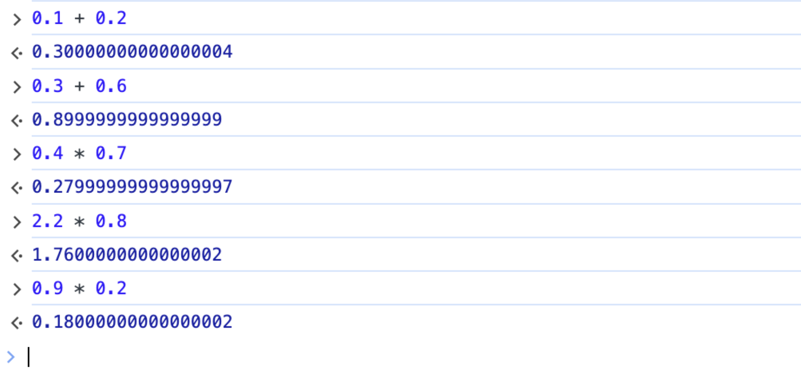
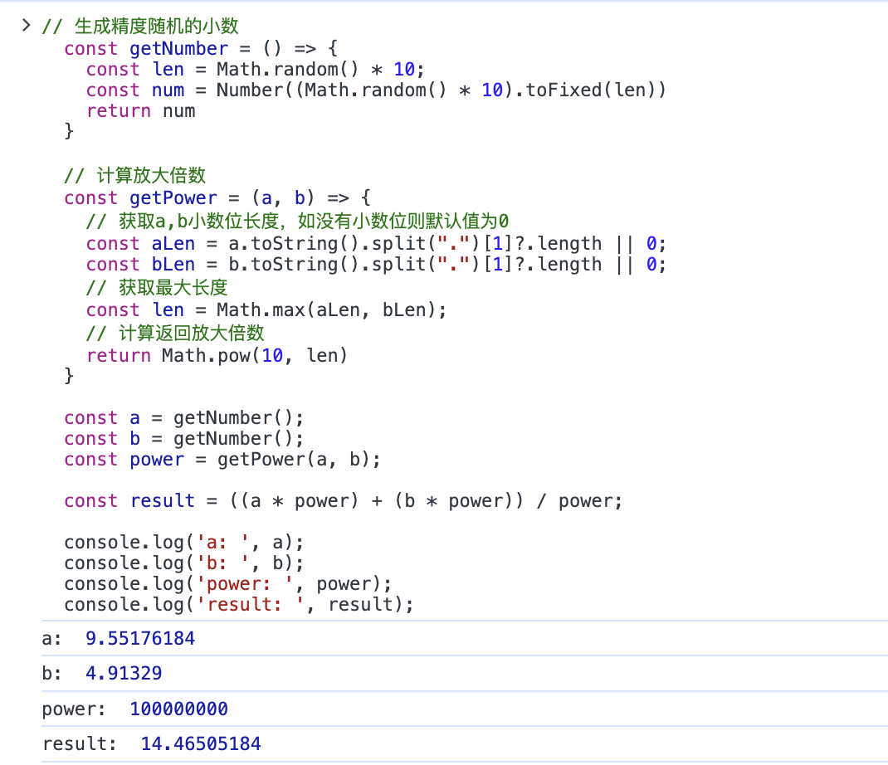
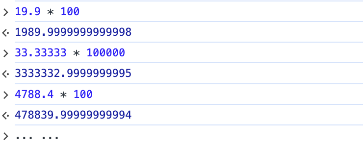
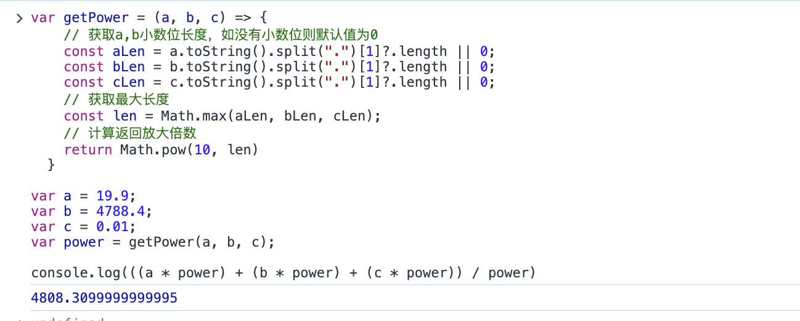
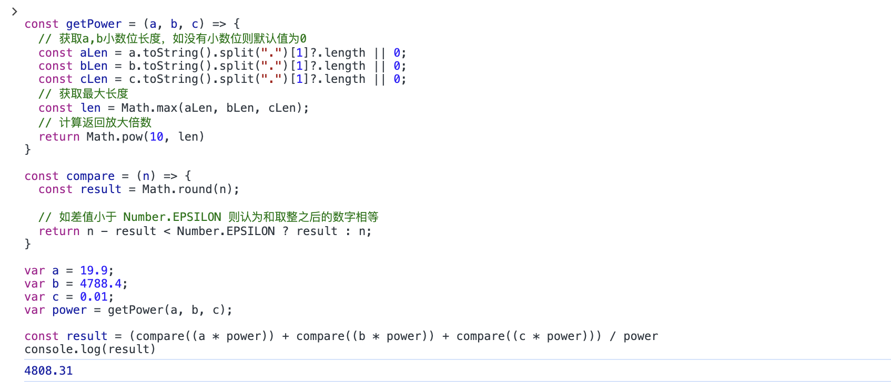
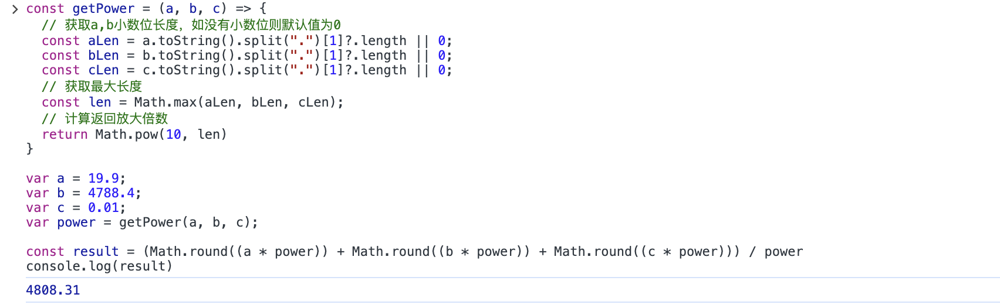

## 故事从0.1+0.2说起

<strong><code>0.1+0.2是否等于0.3呢?</code></strong>

这是一个前端人耳熟能详的故事，每一个初入前端世界的人，应该都会被它来一次灵魂拷问。它的出现，似乎打破了人们以往对于代码世界<code>“执行严谨、一丝不苟”</code>的刻板印象。然而，这看起来<code>“不够严谨”</code>的形成原因，却正是因为<code>底层代码执行的足够严谨</code>！

在初入前端世界的时候，有那么一瞬，我甚至在想<code>难道是底层对于<strong>0.1</strong>和<strong>0.2</strong>有一种特殊的感情？</code>

然而事实并非如此，能被底层这种庞然大物看上并针对的，当让不会只有<code><strong>0.1</strong></code>和<code><strong>0.2</strong></code>这两个看起来平平无奇的数字，而是包含了这两个数字在内的一批特殊存在。

如下图所示：



当然，除上述图片内的数字之外，还有更多的其他数字也在这反常理的队列之内。

然而，这篇文章我们并不是来深入讨论这些特殊的数字在进行数学计算时，与底层究竟产生了什么样的恩怨纠葛。我们只需要简单知道：<code>在计算机世界中，所有信息最后都是以二进制存储的，<strong>可是数字中的小数部分在按照一定规则转换为二进制时，有些数字会产生无限循环的现象，但计算机精度位数是有限的，所以对超出位数的部分做了四舍五入的计算，因此造成了精度的丢失。</strong></code>

本文仅仅针对以上现象，结合日常开发的实践，讨论一些解决问题的方法。

## 初步解决

既然是因为小数部分在转换二进制时做了四舍五入的处理，那么计算时先将小数转为整数再计算是不是就可以了？

依据上面的思想，在<code>javascript</code>中进行小数计算，通常会采用放大倍数取整之后再计算，得出结果之后再缩小还原的技术方案。
> 例：计算0.1+0.2，通常会将0.1和0.2放大10倍，相加之后再缩小10倍

代码如下：

```js
  /**
   * 已知：a为0.1，b为0.2
   * 求：a与b的和
   * */
  const a = 0.1;
  const b = 0.2;
  const result = ((a * 10) + (b * 10)) / 10;
  console.log(result) // 0.3
```

如上，针对已知小数位数的数字，我们可以直接`采用放大相应倍数取整，然后再计算的方式`来规避小数计算的精度问题。

可是在实际的业务开发中，对于需要进行计算处理的数字，我们往往无法预先获知数字包含的小数位数。对于此种情况，我们便`需要先确定小数位数，然后确定放大倍数，再进行计算。`

代码如下：

```js
  /**
   * 已知：a，b为两个精度随机的小数
   * 求：a与b的和
  */

  // 生成精度随机的小数
  const getNumber = () => {
    const len = Math.random() * 10;
    const num = Number((Math.random() * 10).toFixed(len))
    return num
  }

  // 计算放大倍数
  const getPower = (a, b) => {
    // 获取a,b小数位长度，如没有小数位则默认值为0
    const aLen = a.toString().split(".")[1]?.length || 0;
    const bLen = b.toString().split(".")[1]?.length || 0;
    // 获取最大长度
    const len = Math.max(aLen, bLen);
    // 计算返回放大倍数
    return Math.pow(10, len)
  }

  const a = getNumber();
  const b = getNumber();
  const power = getPower(a, b);

  const result = ((a * power) + (b * power)) / power;
```

因为以上代码中，`a`和`b`皆由`getNumber`函数随机生成，为了便于观察，我们添加`log`后，在浏览器中运行代码。

如下图所示：



观察可知，计算结果正确。以上，我们通过使用`getPower`函数确定放大的倍数，然后进行计算。这也是目前大部分同学解决小数计算精度问题的主要方式。

<strong><code>然而，故事到这里就结束了吗？</code></strong>


<strong><code>当然不是！</code></strong>

以上方式虽然解决了一些精度问题，但是并没有解决所有的精度问题。在这个特殊的小数群体中，`并不是所有的小数都可以通过放大倍数来取整的！`

如下图所示：



因此先放大再计算也并不是十分可靠，如下图所示：



## 大胆取舍

### Number.EPSILON

我们已经知道，精度的误差是由于底层在计算时做了一些四舍五入造成的，因此我们分析后可以断定<code>被舍弃的部分一定是小于可以表示的最小浮点数的。</code>

> 例如：<code>有数字 <strong>a</strong> 为 <strong>1.234</strong>，对 <strong>a</strong> 做保留两位小数的处理后，得到数字 <strong>b</strong> ，<strong>b</strong>的值为<strong>1.23</strong>。则上述操作中舍弃的部分 0.004，一定小于保留精度 <strong>0.01</strong> </code>

基于以上分析，我们有理由相信：在 `javascript` 中当两个数字之间的差值小于可以表示的最小浮点数，那么我们就认为这两个数字相等。

可是，最小的浮点数该如何获取呢？

<code>javascript 为我们提供了这样一个属性：<strong>`Number.EPSILON` 静态数据属性，表示 1 与大于 1 的最小浮点数之间的差值。</strong></code>

详细介绍可查看[MDN](https://developer.mozilla.org/zh-CN/docs/Web/JavaScript/Reference/Global_Objects/Number/EPSILON)。

我们对之前的代码做一些优化，在放大一定倍数之后，做差值比较，确认最终结果。

代码如下：
```js
const getPower = (a, b, c) => {
  // 获取a,b小数位长度，如没有小数位则默认值为0
  const aLen = a.toString().split(".")[1]?.length || 0;
  const bLen = b.toString().split(".")[1]?.length || 0;
  const cLen = c.toString().split(".")[1]?.length || 0;
  // 获取最大长度
  const len = Math.max(aLen, bLen, cLen);
  // 计算返回放大倍数
  return Math.pow(10, len)
}
// 差值比价
const compare = (n) => {
  const result = Math.round(n);

  // 如差值小于 Number.EPSILON 则认为和取整之后的数字相等
  return n - result < Number.EPSILON ? result : n;
}

var a = 19.9;
var b = 4788.4;
var c = 0.01;
var power = getPower(a, b, c);

const result = (compare((a * power)) + compare((b * power)) + compare((c * power))) / power
console.log(result)
```

在浏览器运行代码，可知计算正确。

如下图所示：



### Math.round

理论上讲，一个两位小数乘 100 后一定会得到一个整数，一个三位小数乘 1000 以后一定也会得到一个整数。同理可知，一个 n 位小数乘（10^n）后，一定可以得到一个整数！

虽然在计算机世界中小数计算有些误差，但通过上述代码我们知道，这个误差小到几乎可以忽略，那么<code>我们是不是可以大胆一点，放大之后无需比较，直接四舍五入！</code>

我们修改以上代码，舍弃<code>compare</code>函数。

代码如下：
```js
const getPower = (a, b, c) => {
  // 获取a,b小数位长度，如没有小数位则默认值为0
  const aLen = a.toString().split(".")[1]?.length || 0;
  const bLen = b.toString().split(".")[1]?.length || 0;
  const cLen = c.toString().split(".")[1]?.length || 0;
  // 获取最大长度
  const len = Math.max(aLen, bLen, cLen);
  // 计算返回放大倍数
  return Math.pow(10, len)
}

var a = 19.9;
var b = 4788.4;
var c = 0.01;
var power = getPower(a, b, c);

const result = (Math.round((a * power)) + Math.round((b * power)) + Math.round((c * power))) / power
console.log(result)
```
在浏览器中运行后发现，结果依然正确。

如下图所示：



## 封装完善
基于以上推导，我们可以封装一个简易的计算函数。

代码如下：
```js
function compute(type, ...args) {
  // 计算放大倍数
  const getPower = (numbers) => {
    const lens = numbers.map(num => num.toString().split(".")[1]?.length || 0);
    // 获取最大长度
    const len = Math.max(...lens);
    // 计算返回放大倍数
    return Math.pow(10, len)
  }

  // 获取放大倍数
  const power = getPower(args);

  // 获取放大后的值
  const newNumbers = args.map(num => Math.round(num * power));

  // 计算结果
  let result = 0;
  switch (type) {
    case "+":
      result = newNumbers.reduce((preNumber, nextNumber) => preNumber + nextNumber, result) / power;
      break;
    case "-":
      result = newNumbers.reduce((preNumber, nextNumber) => preNumber - nextNumber) / power;
      break;
    case "*":
      result = newNumbers.reduce((preNumber, nextNumber) => preNumber * nextNumber) / (power ** newNumbers.length);
      break;
    case "/":
      result = newNumbers.reduce((preNumber, nextNumber) => preNumber / nextNumber);
      break;
  }

  return {
    result,
    next(nextType, ...nextArgs) {
      return compute(nextType, result, ...nextArgs);
    }
  }
}

// 验证
const arr = [0.1, 0.2, 29.6]
const a = compute('+', ...arr);
const b = a.next('-', 4, 2, 4);
const c = b.next('*', 100);
const d = c.next('+', 2798.4);
const e = d.next('*', 100);
const f = e.next('/', 1000);
const r = compute('+', ...arr).next('-', 4, 2, 4).next('*', 100).next('+', 2798.4).next('*', 100).next('/', 1000);

console.log('a: ', a.result) // a:  29.9
console.log('b: ', b.result) // b:  19.9
console.log('c: ', c.result) // c:  1990
console.log('d: ', d.result) // d:  4788.4
console.log('e: ', e.result) // e:  478840
console.log('f: ', f.result) // f:  478.84
console.log('r: ', r.result) // f:  478.84
```
经简单测试后，可知<code>compute</code>函数已实现基本的四则运算，且可以链式调用。

## 结语
若有错误，请务必给予指正。
谢谢！

## 参考文档

[Number.EPSILON](https://developer.mozilla.org/zh-CN/docs/Web/JavaScript/Reference/Global_Objects/Number/EPSILON)


<!-- 19.9 * 100 -->
<!-- 23.26*10 -->
<!-- 33.33*10 -->
<!-- 33.33333*100000 -->
<!-- 4788.4*100 -->

