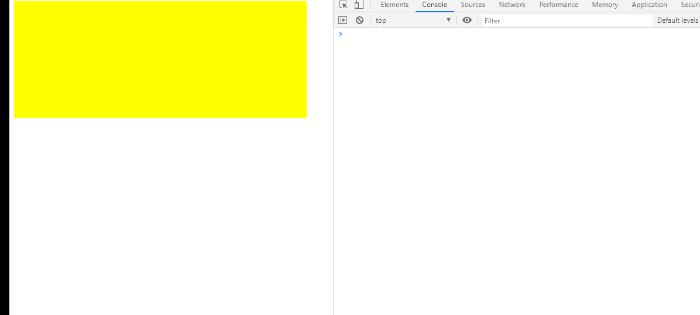

## 概念原理
在项目开发中，会有一些事件高频触发的场景，例如:     
- 1、浏览器窗口的缩放，页面的滑动触发的 `resize` ，`scroll`   
- 2、鼠标事件 `onmousemove` ，`onmousedown`， `onmouseup`   
- 3、输入框录入触发的 `keyup` ，`keydown`   
- .....    

为了优化此类场景，我们通常会使用两种方案：    
- 节流：事件高频触发中，每 n 秒执行一次。    
- 防抖：事件高频触发后，间隔 n 秒执行一次。    

关于二者之间的区别，由以上原理可知，是执行回调函数的时机不同：节流函数的回调执行时机是在高频触发中，而防抖函数的回调函数执行时机是在高频触发后。

## 实现
根据以上原理，我们可以写出第一版简单实现：    

`html` 页面代码

```html
<body>
    <div id="root" style="width: 500px;height: 200px;background: yellow;"></div>
    <script>
      function func(e) {
        console.log('mousemve', this, e);
      }
      // 节流
      function throttle(){}
      //防抖
      function debounce(){}

      root.addEventListener('mousemove', throttle(func, 1000));
    </script>
</body>
```

### 防抖
```js
/**
 *  思路：
 *  每次事件触发删除已有定时器，设置新的定时器，等待 n 秒触发事件回调
 **/
function debounce(fn, wait){
  let timer;
  return function(...args){
    let ctx = this;
    clearTimeout(timer);
    timer = setTimeout(function(){
      fn.apply(ctx, args);
      timer = null;
    }, wait)
  }
}
```
效果图：

### 节流
节流函数的实现有两种方式：  
&emsp;1、时间戳   
&emsp;2、定时器

**时间戳实现**
```js
/**
 * 思路：
 * 每次事件触发，对比当前时间和上次回调执行时间，若间隔大于等待时间则执行
 **/
function throttle(fn, wait){
  let previous = 0;
  return function(...args){
    let ctx = this;
    let now = +new Date();
    if(now - previous > wait){
      fn.apply(ctx, args);
      previous = now;
    }
  }
}
```
效果图：


**定时器实现**
```js
/**
 * 思路：
 * 每次事件触发，判断定时器是否存在
 * 若不存在则设置定时器，
 * 若存在则等待定时器执行完毕之后重新设置定时器
 **/
function throttle(fn, wait){
  let timer;
  return function(...args){
    let ctx = this;
    if(!timer){
      timer = setTimeout(function(){
        timer = null;
        fn.apply(ctx, args)
      }, wait)
    }
  }
}
```
效果图：

## 改进
通过以上处理，我们已经可以对高频事件的执行频率及时机加以控制，但是，通过观察我们发现上述代码还存在以下问题：    
&emsp;1、在防抖函数中，鼠标初次进入色块时，回调函数未执行   
&emsp;2、在时间戳节流中，鼠标离开色块，间隔 1 秒后回调函数不会执行    
&emsp;3、在定时器节流中，鼠标初次进入色块时，回调函数未执行   

针对以上问题，我们对函数做出以下调整：

**防抖**    
接受一个 option 参数对象，控制初次触发是否执行回调函数，option 为对象便于扩展其他控制功能  
```js
/**
 *  思路：
 *  !timer 为 true 则认为是首次触发
 *  leading 等于 true 则首次触发执行回调
 **/
function debounce(fn, wait, option={}){
  let timer;
  let { leading } = option;
  return function(...args){
    let ctx = this;
    if(!timer && leading === true){ // 初次触发执行回调
      fn.apply(ctx, args);
    }
    clearTimeout(timer);
    timer = setTimeout(function(){
      fn.apply(ctx, args);
      timer = null;
    }, wait)
  }
}
```

**节流**    
我们整合时间戳实现和定时器实现，完成初次触发及鼠标离开后的回调执行
```js
/**
 *  思路：
 *  计算出距离下次事件执行的时间：wait - (now - previous)
 *  若距离下次执行的时间 <=0 则执行回调，并清除定时器
 *  若未到执行时间，且没有定时器，则设置定时器，确保鼠标脱离色块后，依旧执行最后一次事件回调
 **/
function throttle(fn, wait) {
  let previous = 0;
  let timer;
  return function (...args) {
    let ctx = this;
    let now = +new Date();
    let remaining = wait - (now - previous);
    
    if (remaining <= 0) {
      if(timer){
        clearTimeout(timer);
        timer = null;
      }
      fn.apply(ctx, args);
      previous = now;
    } else if (!timer) {
      timer = setTimeout(function () {
        previous = +new Date();
        timer = null;
        fn.apply(ctx, args);
      }, remaining)
    }
  }
}
```
## 优化
在节流函数中，我们还可以通过传递 `option` 配置参数对初次触发及尾随触发的回调执行加以控制。       
我们复用改进后的节流函数，默认执行头尾回调。借鉴前人的宝贵经验，我们来指定两个变量，对头尾回调函数的执行加以控制：    
&emsp;当 leading === false 时，我们取消初次触发的函数回调执行     
&emsp;当 trailing === false 时，我们取消尾随回调的执行

```js
/*****
  思路：
    1、trailing === false 时，尾随回调不执行
      可直接添加判断，当 trailing !== false 时，才添加定时器执行尾随回调
    2、leading ==== false 时，初次回调不执行
      默认中，初次触发回调执行的判断条件是当 remaining <= 时执行
      当 previous 等于 0 时，为初次触发，若使回调不执行，我们可以强制将 remaining 值设为大于 0
      （将 previous 设置为 now ，可得 remaining === wait ，使定时器准时触发）

      执行过程：
          当我们强制设置 remaining > 0 后，第一次触发函数时，将设置定时器，
          第二次触发函数时， 因为 timer 为 true 则函数无反应
          直至定时器执行，设置 timer = null ， previous = 0 
      注意：
        定时器执行时，若不设置 previous 为 0 ，当鼠标脱离目标区域，等待时间大于设置 awit 值
        时，再次触发节流函数，因为 previous 未被释放， !previous 为 false ，则不能强制设置 
        remaining > 0 ，因此依旧会执行初次回调，产生 BUG

****/
function throttle(fn, wait, option) {
  let previous = 0;
  let timer;
  let { leading, trailing } = option;

  return function (...args) {
    let ctx = this;
    let now = +new Date();
    if(!previous && leading === false) previous = now; // 通过设置 previous 使  remaining > 0
    let remaining = wait - (now - previous);

    if (remaining <= 0) {
      if (timer) {
        clearTimeout(timer);
        timer = null;
      }
      fn.apply(ctx, args);
      previous = now;
    } else if (!timer && trailing !== false) { // 当 trailing !== false 时，添加定时器，执行尾随回调
      timer = setTimeout(function () {
        previous = leading === false ? 0 : +new Date(); // 将 previous 设置为 0
        timer = null;
        fn.apply(ctx, args);
      }, remaining)
    }
  }
}
```
**观察以上代码可知，`trailing: false` 与 `leading: false` 不能同时设置。**

当同时设置两个属性时，第一次触发回调，由于 `leading === false` 且 `previous = 0`，所以 `remaining > 0`，函数不执行。

当第二次触发回调，由于第一次触发时，已经设置 `previous = now` ，所以 `!previous` 为 `true` ，`remaining` 值无法强制设置，直至接下来某次触发回调的时间间隔大于设置的 `wait` 时，代码走进 `remaining <= 0` 的 `if` 判断分支。   

而鼠标移出时，因为 `trailing === false` ， 则无法开启定时器，不能初始化`previous = 0` ， 当等待时间大于设置的 `wait` 值时，再次触发回调，会立即执行，因此违反了 `leading === false` ，产生 BUG。

## 结语  
以上，我们已经对节流和防抖做了简单了解。    
若有错误，请务必给予指正。      
谢谢！


